# Week 1 – Python Foundations

## Introduction

This repository contains my work for **Week 1: Python Foundations** in the **Introduction to Big Data Analytics** course at AUCA.

The purpose of this lab was to learn and practice the basic Python concepts needed for data analysis. The exercises covered variables, data types, strings, lists, dictionaries, and basic analysis of a dataset containing information about 20 AUCA students.

---

## Objectives

During this lab, I learned and practiced:

* Creating and using Python variables
* Understanding basic data types such as `str`, `int`, `float`, and `bool`
* Converting data from one type to another
* Working with strings and f-strings
* Using string methods such as `.upper()`, `len()`, and slicing
* Creating and modifying lists
* Calculating basic descriptive statistics
* Creating and updating dictionaries
* Accessing data using dictionary keys
* Analyzing a dataset of 20 students
* Finding averages, highest and lowest values, and ranges
* Counting data by category
* Identifying the top-performing student without using a loop

---

# Part 0 – Warm-Up

The first step was creating and running a Python notebook. I tested the notebook by printing:

```python
print("Hello, Big Data!")
```

### Screenshot


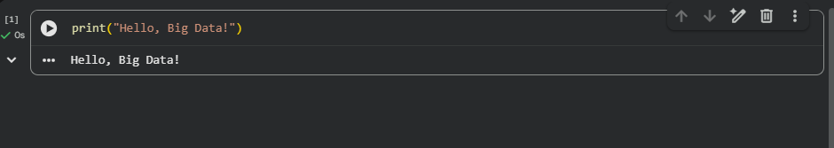

---

# Part 1 – Variables and Data Types

## Exercise 1.1 – Creating Variables

I created four variables describing myself:

* `my_name` as a string
* `my_age` as an integer
* `my_gpa` as a float
* `am_i_present` as a Boolean

I then printed each variable together with its Python data type.

### Screenshot


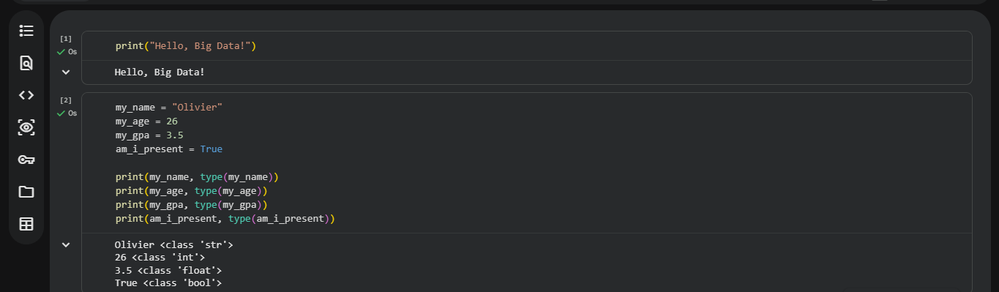

---

## Exercise 1.2 – Type Conversion

In this exercise, I started with an age stored as text:

```python
age_text = "21"
```

I converted it from a string into an integer, added `1`, and printed the result.

This helped me understand how Python can convert text containing numbers into actual numerical values.
---

## Exercise 1.3 – Strings and Addition

I tested what happens when adding:

```python
"3" + "4"
```

The result was `34` instead of `7` because the values are strings. Python joins the text together instead of performing mathematical addition.

### Screenshot


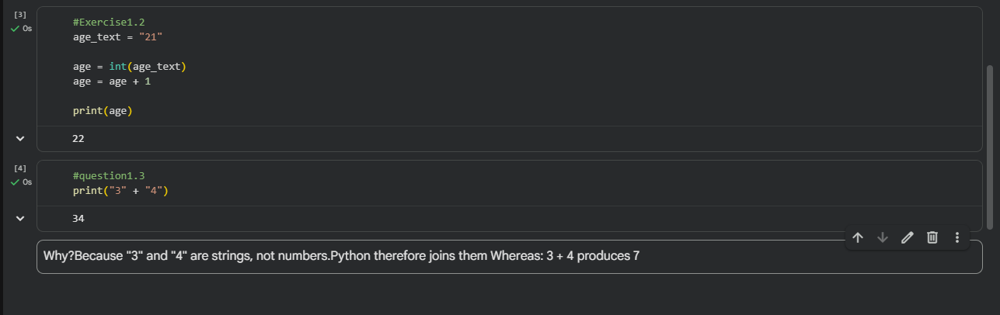

---

# Part 2 – Strings: Working with Text

## Exercise 2.1 – F-Strings

I used an f-string to combine variables and create a sentence containing my name and age.

Example structure:

```python
f"I am {my_name}, {my_age} years old, studying at AUCA."
```

This demonstrated how f-strings make it easier to include variables inside text.

---

## Exercise 2.2 – String Tools

Using the course name:

```python
course = "Big Data Analytics"
```

I practiced:

* Converting text to uppercase using `.upper()`
* Counting characters using `len()`
* Extracting the first three characters using slicing `[0:3]`

### Screenshot


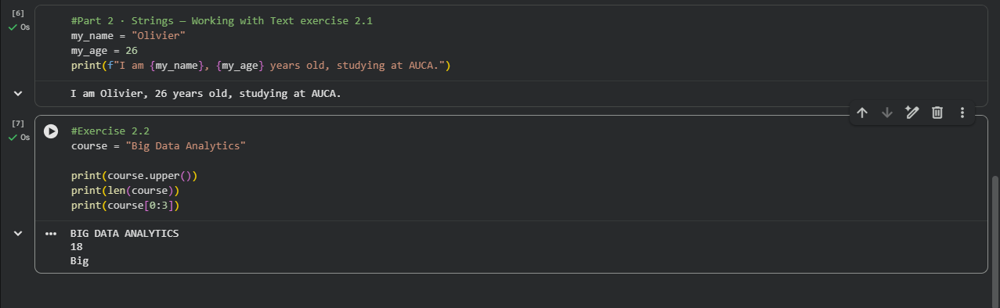

---

# Part 3 – Lists and Descriptive Statistics

## Exercise 3.1 – Quiz Score Analysis

I worked with the following list of quiz scores:

```python
scores = [72, 85, 91, 64, 78]
```

Using Python list operations, I found:

* The first score
* The last score
* The number of scores
* The average score
* The highest score
* The lowest score

This introduced me to basic descriptive statistics using Python functions such as:

```python
len()
sum()
max()
min()
```

### Screenshot


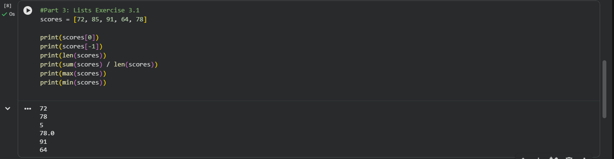

---

## Exercise 3.2 – Updating a List

I modified the list by:

1. Adding a new score of `88`
2. Changing the score at position `3` from `64` to `66`
3. Printing the updated list
4. Calculating the new average

This helped me understand that Python lists can be changed after they are created.

### Screenshot


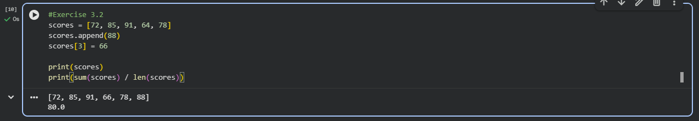

---

# Part 4 – Dictionaries: Labeled Data

## Exercise 4.1 – Creating a Dictionary

I created a dictionary called `me` containing information about myself, including:

* Name
* Age
* Program
* District

I then accessed and printed my program using:

```python
me["program"]
```
---

## Exercise 4.2 – Updating and Extending a Dictionary

I updated the dictionary by:

* Adding a new key called `score`
* Increasing the value of `age` by `1`
* Printing all dictionary keys using `.keys()`
* Printing the complete dictionary

This helped me understand how dictionaries can store labeled information and be updated when needed.

### Screenshot


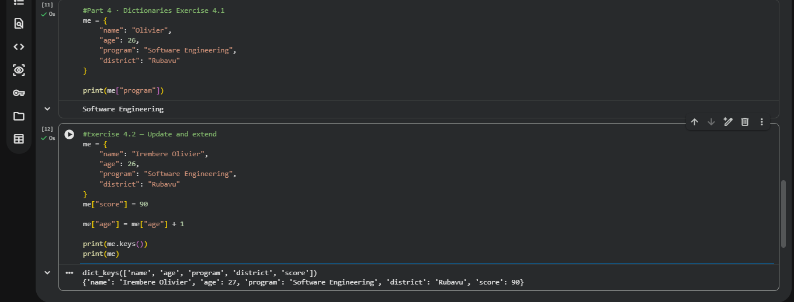

---

# Part 5 – Class Dataset Analysis

For this part, I analyzed a dataset containing information about **20 AUCA students**.

The dataset included information such as:

* ID
* Name
* Age
* Gender
* Program
* District
* Attendance percentage
* Score

I used the provided dataset and analyzed it using Python lists and dictionaries.

### Connecting to google drive 

   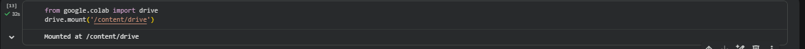
   
### Importing csv

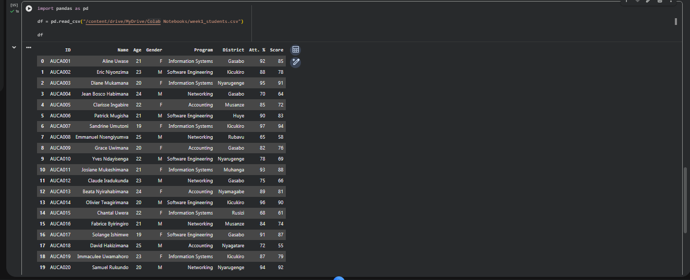

### Renaming columns to matchs teachers naming

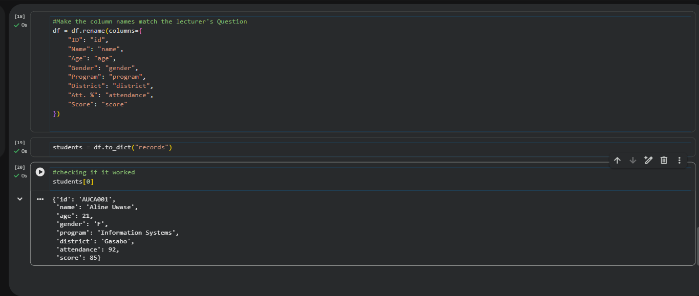

---

## Exercise 5.1 – Describing the Class

I calculated:

* The total number of students
* The class average score rounded to one decimal place
* The highest score
* The lowest score
* The score range

This exercise showed how Python can quickly perform basic statistical analysis on a dataset.

## Exercise 5.2 – Inspecting Individual Records

I printed:

* The complete record of the first student
* The complete record of the last student
* Information about the student at position `6`

I used an f-string to display information in the following format:

```text
NAME from DISTRICT studies PROGRAM and scored SCORE.
```

### Screenshot


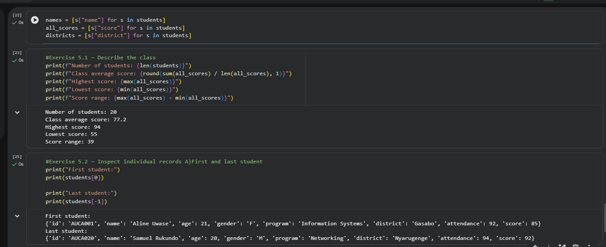

---

## Exercise 5.3 – Counting Students by District

I counted the number of students from:

* Gasabo
* Kicukiro
* Another district of my choice

I used the `.count()` method to find how many times each district appeared in the dataset.

### Screenshot


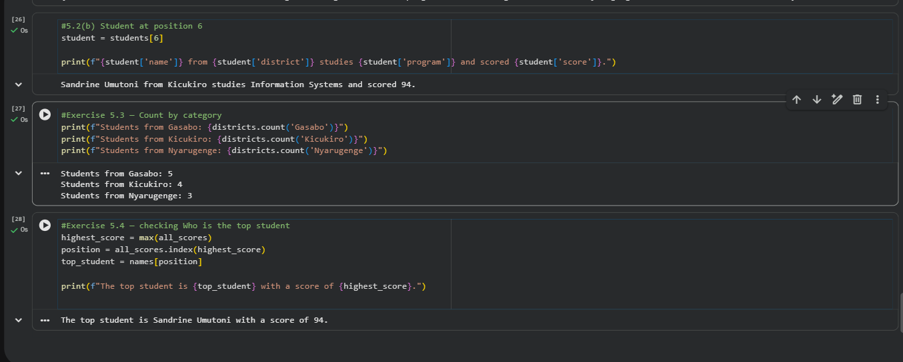

---

## Exercise 5.4 – Finding the Top Student

Without using a loop, I found the student with the highest score.

I combined:

```python
max(all_scores)
```

to find the highest score,

```python
all_scores.index(...)
```

to find its position, and

```python
names[position]
```

to find the corresponding student's name.

I also completed the bonus challenge by finding the student with the lowest score and displaying the attendance information.

### Screenshot

<!-- Add your Part 5.4 screenshot below -->

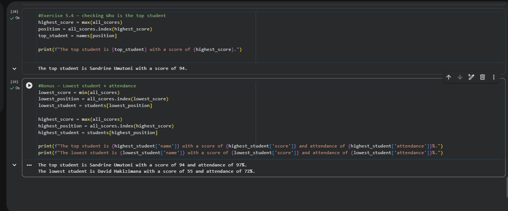

---

# Part 6 – Reflection

## 1.Is this 20-student dataset Big Data? Which of the 5 V's does it clearly not have yet? Explain briefly

No, this 20-student dataset is not Big Data. It is a small dataset because it contains only 20 records and can easily be stored, processed, and analyzed using a normal computer and Python.

The 5 V's of Big Data are Volume, Velocity, Variety, Veracity, and Value. This dataset clearly does not have Volume, because 20 student records are far too small to represent a large amount of data. It also does not clearly demonstrate Velocity, because the data is static rather than being generated or updated continuously at high speed. It has a simple and consistent structure, so it also has very little Variety compared with real Big Data, which may contain text, images, videos, sensor data, and other formats.

Therefore, this dataset is useful for learning data analysis, but it is not Big Data because it lacks the large scale and complexity normally associated with Big Data.

## 2.Describe one thing from today's session that surprised or confused you

One thing that surprised me during today's session was how we used a CSV file and converted its data into a form that could be easily used and analyzed by Python in Google Colab. I was also surprised by how easily Python can manipulate data, such as selecting specific information, calculating averages, finding the highest and lowest scores, and organizing data using lists and dictionaries. As someone studying Python for the first time, I found it interesting that a small amount of code can perform operations on many records at once. I was also surprised by how lists, dictionaries, and functions can work together to make data analysis easier. This helped me understand that Python is not only used for writing programs but can also be very useful for working with and analyzing real-world data.

---

# Author

->*Olivier Irembere 28392*,

->*INTRO-TO-BIG-DATA-GROUP-A*,

->*Software Engineering*,

->*AUCA*

---

## Repository

This work was completed as part of the **Week 1 Python Foundations Lab** for the **Introduction to Big Data Analytics** course.
